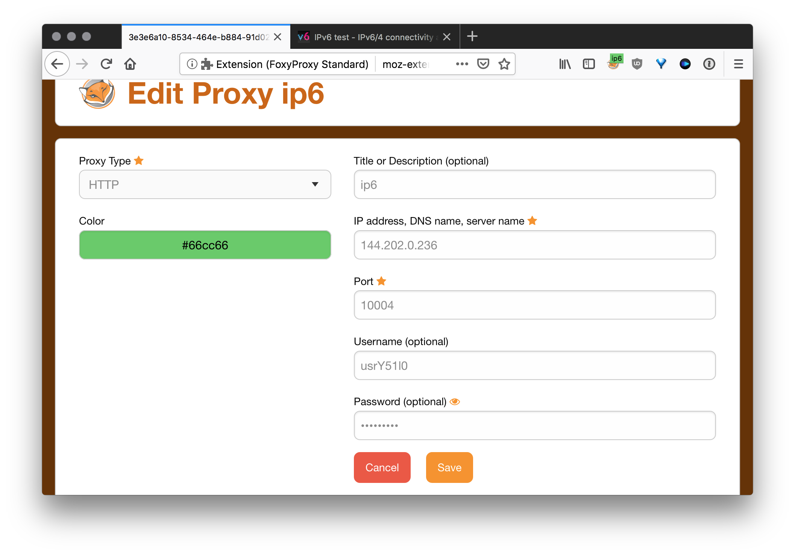

Redirect connections from different ports at one ipv4 address to unique random ipv6 address from \64 subnetwork. Based on 3proxy

## Requirements
- Centos 8
- Ipv6 \64

## Installation
VPS from [Vultr *100$ free*](https://www.vultr.com/?ref=9406147) used as Centos setup

1. `bash <(curl -s "https://raw.githubusercontent.com/Wathfea/letsdoproxy/main/scripts/install.sh")`
2. The script will reboot your server after installation, so you will need to reconnect to it

3. After installation dowload the file `proxy.zip`, you can find the url in /home/proxy-installer/proxies_zip_url.txt and the password in /home/proxy-installer/proxies_zip_password.txt
   * File structure: `IP4:PORT:LOGIN:PASS`
   * You can use this online [util](http://buyproxies.org/panel/format.php
) to change proxy format as you like

3. If you need IPV4 proxies you can use [this](https://buyproxies.org/panel/aff.php?aff=2766) service
## Test your proxy

Install [FoxyProxy](https://addons.mozilla.org/en-US/firefox/addon/foxyproxy-standard/) in Firefox

Open [ipv6-test.com](http://ipv6-test.com/) and check your connection

